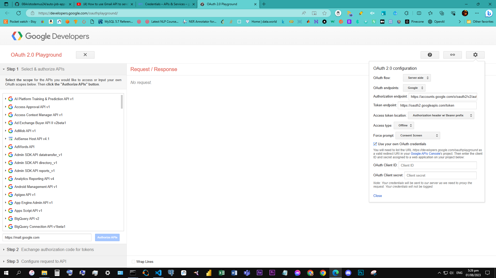

# **STILL IN PRODUCTION**

# Note: Gmail API requires OAuth2.0 for authentication. PyDrive makes your life much easier by handling complex authentication steps for you.**

# Go to APIs Console and make your own project.
1. Search for **Gmail API**
2. select the entry, and click **Enable**.
3. Select **Credentials** from the left menu, click **Create Credentials**, select **OAuth client ID**.
4. Now, the product name and consent screen need to be set -> click **Configure consent screen** and follow the instructions.
5. Once finished select **Application type** to be *Web application*.
6. Enter an appropriate name.
7. Input *http://localhost:8080* for **Authorized JavaScript origins**.
8. Input *http://localhost:8080/* for **Authorized redirect URIs**.
9. Click **Save**.
10. Click **Download JSON** on the right side of Client ID to download `client_secret_<really long ID>.json`.
11. The downloaded file has all authentication information of your application. Rename the file to `client_secrets.json` and place it in your working directory.

# if an error 403 occurs fix this issue by the following steps
1. Go to again https://console.developers.google.com/
2. On the top left beside the words "Google APIs" click the project dropdown on the right
3. Ensure that your correct project is selected
4. Click "OAuth consent screen" on the left side of the screen (below "Credentials")
5. If you have not created a consent screen, do that first
6. Under "Test users" there is a button called "+ ADD USERS"
7. Type the email of the account you will be testing with, press enter, then click save.
8. It should work now!

# This message [(403) Access Not Configured]
...means that when you set up your Google Drive Access, you missed out "Activate the google drive API". You did not configure the Drive API to enabled in your Google account. To Activate the Drive API, go to Developers Console and Enable the Google Drive API.

Here's a link to enable Drive API: https://developers.google.com/drive/v3/web/enable-sdk

# 400 error
1. Assuming we have placed in our Authorized redirect URIs https://developers.google.com/oauthplayground go to that link
2. 